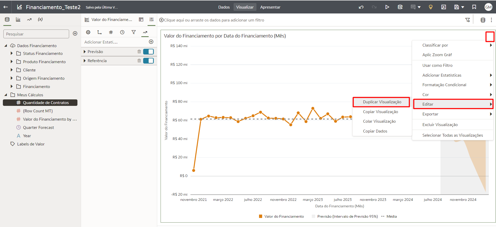
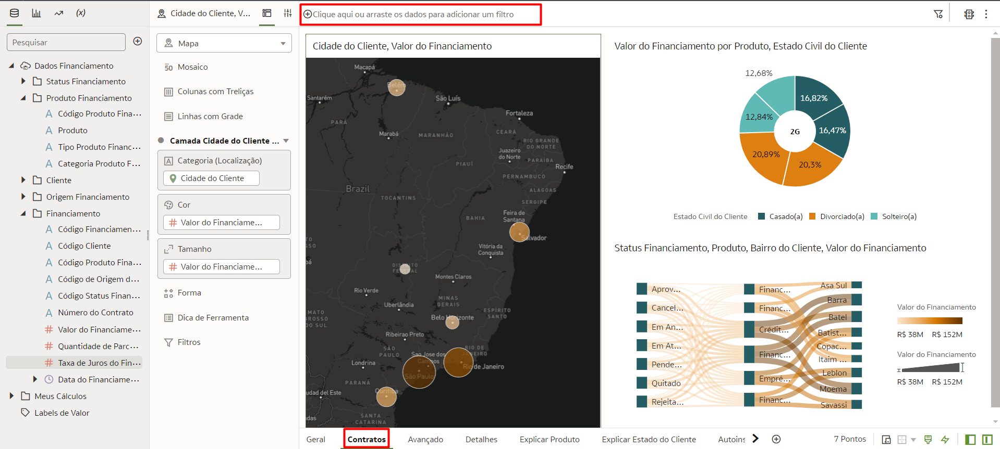

# Criar Dashboards - Avançado

## Introdução

Neste Lab você vai dar um passo a mais no desenvolvimento de suas análises utilizando funcionalidades avançadas que o Oracle Analytics Cloud (OAC) oferece para você para enriquecer ainda mais seus insights.

[Oracle Video Hub video scaled to Large size](videohub:1_6oeev9ax:large)

*Tempo estimado para o Lab:* 25 Minutos

### Objetivos
* Aprender a adicionar estatísticas em seu gráficos
* Aprender a criar regras de formatação condicional
* Aprender a adicionar filtros no seu dashboard
* Aprender a criar "Ações de dados"


## Tarefa 1: Adicionar Estatísticas no Dashboard

O Oracle Analytics Cloud (OAC) te oferece uma forma muito simples de adicionar estatísticas em seus gráficos. Os tipos disponíveis são: *Clusters, Outliers, Linha de Referência, Linha de Tendência, Previsão (Forecast)*

1. Crie uma nova tela no seu arquivo de trabalho clicando no sinal de **+** na parte inferior da tela.


2. Em seguida vamos renomear essa tela, clique no triângulo ao lado do nome da tela e clique em renomear.


3. Digite o nome **"Avançado"** e clique no sinal de check para confirmar. Selecione e arraste a aba para ficar entre "Contratos" e "Detalhes". 


4. Segure a tecla Control (CTRL) e selecione os campos **Valor do Financiamento** e **Data do pedido (Mês)** dentro da tabela "Financiamento", arraste e solte no centro da tela. Ele irá criar um gráfico de linha.


Você vai notar que um gráfico de Linha será criado automaticamente. Aqui nós iremos criar uma previsão de vendas para os próximos 3 meses.

5. Clique com o botão direito do mouse no gráfico, em seguida selecione **"Adicionar Estatísticas"** e selecione **"Previsão"**.


6. Edite nas propriedades do gráfico o período da previsão, entre na aba de Propriedades no ícone de Análise, na categoria "Previsão" adicione 6 para o item **Períodos**.


Após alguns segundo você a previsão do valor do faturamento para os próximos 6 meses adicionada ao seu gráfico. A previsão é a área em cinza claro.


Agora nos vamos adicionar um a Linha de Referência no mesmo gráfico que criamos a previsão.

7. Clique com o botão direito do mouse no gráfico, em seguida selecione **"Adicionar Estatísticas"** e selecione **"Linha de Referência"**.


Após alguns segundo você verá a Linha de Referência em seu gráfico


> **Note:** Como mostrado nos passos anteriores podemos combinar mais de um tipo de estatística em um mesmo gráfico.


8. Duplique o gráfico de Previsão do Valor do Fianciamento, clique nos três pontinhos, selecione **Editar**, depois selecione **Duplicar Visualização**.



9. Substitua o **Quantidade de Contratos** por **Quantidade de Contratos**, selecione, arraste **Quantidade de Contratos** para o quadrante de Valores (Eixo Y) até o **Quantidade de Contratos** ficar com um X vermelho no canto superior direito, estão solte o elemento.


*DESAFIO:* Crie mais um gráfico com as informações de Financiamento Valor e Taxa de Juros por Cliente e adicione a estatística de **"Clusters"** nesse gráfico para você identificar quai seriam os padrões de grupos dos cliente de financiamento

Esse deve ser seu resultado final:


## Tarefa 2: Formatação Condicional

Use a Formatação Condicional para destacar dados importantes em suas visualizações para que você possa tomar melhores decisões.

1. Na aba de Tipos de Gráfico, clique a arraste o tipo "Tabela Dinâmica" e solte na parte inferior da tela quando uma barra verde aparecer.


2. Segurando o Control (CTRL) selecione os campos: **Valor do Financiamento**, **Data do Financiamento (Mês)** e **Categoria Produto Financiamento**, em seguida arraste os 3 campos para o gráfico de tabela dinâmica que você adicionou no dashboard no passo anterior.


3. Verifique se o campo "Categoria Produto Financiamento" está em baixo do campo "Data do Financiamento (Mês)" na área de linhas da Tabela Dinâmica.


4. Clique com o botão direito do mouse sobre a tabela dinâmica, selecione "Formatação Condicional" e clique em "Gerenciar Regras".


5. Dê o nome *"Financiamento"* para a nova regra e em seguida selecione "Valor do Financiamento" no campo Medida.


6. Agora adicione um formato padrão disponível, com divisão de 5 formatações. E preencha os valores da seguinte forma, após terminar de preencher lembre de salvar a regra de formatação:

* ***Valor do Financiamento >  20.000.000 - Cor: Verde Escuro***
* ***Valor do Financiamento > 15.000.000 - Cor: Verde Claro***
* ***Valor do Financiamento >  10.000.000 - Cor: Amarelo***
* ***Valor do Financiamento >  5.000.000 - Cor: Laranja***
* ***Valor do Financiamento <=  5.000.000 - Cor: Vermelho***


Você vai notar que cada valor de venda possui uma cor associada e dessa forma você consegue visualizar as informações de forma mais agradável e facilmente identificar informações como, por exemplo, os valores em vermelho que indicam valores de vendas abaixo do esperado. Atualmente além das cores e formato no número pode adicionar emojis ou ícones na formatação considional.


## Tarefa 3: Adicionar Filtros

Temos algumas formas de adicionar filtros no Oracle Analytics Cloud. Nessa tarefa vamos adicionar filtros através da barra de filtros e vamos aprender a tornar esse filtro disponível em todas as telas do nosso Dashboard.

A barra de filtro fica na parte superior da tela, todos os filtros criados ficaram disponíveis nesse local.



1. Na aba de Contratos, clique no sinal de + na barra de filtro e selecione o campo "Status Geral" na tabela de Status Financiamento.


2. Selecione o campo "Status Geral" na barra de filtro e aplique o filtro para **"Contratos"** .


3.  Na barra lateral de opções, clique no símbolo indicado por um **+** e em seguida clique na opção **Criar Cálculo...**.


4.  Na janela que se abrir, coloque o nome do campo como **Status Atual**, digite o código a seguir e clique em **Validar** e posteriormente em **Salvar**.

```
CAST(RANK(Data do Financiamento by Número do Contrato) AS CHAR(1))
```


5. Navegue até a aba **""Detalhes**, clique novamente no sinal de **+** na barra de filtro e agora selecione o campo "Status Atual" na pastinha Meus Cálculos.


6. Selecione o campo "Status Atual" na barra de filtro e aplique o filtro para **"1"** .


7. Clique novamente no sinal de **+** na barra de filtro e agora selecione o campo "Data do Financiamento" na tabela Financiamento. E selecione o campo **"Tempo Relativo"**, Incremento **"6"** e Nível de tempo **"Meses"**.


Você pode adicionar os filtros de acordo com suas necessidade de analisar as informações nessa tela.


Agora vamos tornar o filtro visível e aplicado em todas as Telas do seu Arquivo de Trabalho.

8. Descanse o cursor do mouse sobre o filtro "Data do Financiamento" até que você veja o ícone de "fixar" ser destacado e clique sobre ele.


Você pode navegar para qualqer aba do seu Dashboard e o filtro "Data do Financiamento" estará fixado.


Agora para mostrar mais algumas funcionalidades de filtros, veremos Filtro de Painel e Filtro de Visualização

9. Na Aba **"Detalhes"**, selecione o **"Filtros do Painel"** e solte em cima da tabela dinâmica.


10. Selecione o campo **"Cidade do Cliente"** e solte no Filtro do Painel.


11. Na Aba **"Geral"**, selecione sua visualização **"Nuvem de Tags"**. Agora, selecione o campo **"Valor do Financiamento"** e solte em cima de Filtros dentro da gramática da visualização.


12. Na tela que aparecer, selecione **"N Mais Altos/Mais Baixos"**, Método **"Mais Altos"** e contagem **"5"**.


Parabéns, você terminou esse laboratório!
Você pode **seguir para o próximo Lab**.

## Conclusão

Nesta sessão você aprendeu a utilizar recursos avançados para criação de Dashboards no Oracle Analytics Cloud (OAC)

## Autoria

- **Autores** - Gabriela Miyazima
- **Último Update Por/Data** - Gabriela Miyazima, Agosto/2024