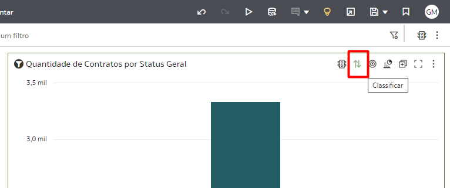

# Criar Visualizações

## Introdução

Nesse Lab você vai aprender a criar visualizações no Oracle Analytics Cloud.

[Oracle Video Hub video scaled to Large size](videohub:1_6xkzayss:large)

*Tempo estimado para o Lab:* 30 Minutos

### Objetivos

* Conhecer a interface de criação de visualizações do OAC
* Criar campos calculados
* Construir um dashboard com gráficos de diferentes tipos
* Alterar propriedades dos gráficos e fazer uso de funcionalidades complementares para personalizar o dashboard


## Tarefa 0: Importar Conjunto de Dados

Para iniciar o laboratório, primeiro você irá importar o arquivo a seguir para o Oracle Analytics Cloud para já ter o conjunto de dados preparado e pronto para uso. 

1.  Realize download do arquivo: [Workshop OAC Financeiro](https://objectstorage.us-ashburn-1.oraclecloud.com/n/idi1o0a010nx/b/Fast_Track/o/WK_Financeiro.dva).


2.  Na Homepage, há três pontinhos ao lado do ícone do perfil do usuário, o Menu da Página selecione, depois selecione **Importar Pasta de Tabalho/Fluxo...**.


3. Selecione o arquivo .dva que foi baixado passo 1 da Tarefa 0. E realize o importe do arquivo WK_Financeiro.


4.  Agora vá no Menu de Hamburguer, selecione Dados, na Aba Conjunto de Dados terá um Conjunto de Dados de nome **Workshop - Dados Financiamento** selecione. Irá Abrir uma tela em branco da Pasta de Trabalho (Workbook), para começar o laboratório para criar os suas visualizações.


## Tarefa 1: Explorar a Interface

O Oracle Analytics Cloud (OAC) possuí uma interface simples, o que permite navegar rapidamente por suas diversas opções e funcionalidades. Em nossa primeira tarefa exploraremos a interface do Oracle Analytics Cloud dentro de uma pasta de trabalho.

Sempre que você abrir ou criar uma pasta de trabalho, por padrão, você terá a seguinte tela no modo de visualização:


Para explorar as demais opções de navegação na interface:

1.  Clique no icone correspondente a **Editar** no menu superior direito da tela.


Após habilitar o modo de edição, a interface da tela devera ter a seguinte configuração:


2.  No menu superior direto da tela encontre a opção correspondente aos comandos de **Desfazer/Refazer a Última Edição**.


3.  No menu superior direto da tela encontre a opção correspondente ao comando de **Visualização**.


4.  No menu superior direto da tela encontre a opção correspondente ao comando de **Atualizar Dados**.


5.  No menu superior direto da tela encontre a opção correspondente ao comando de **Adicionar Observação**.


6.  No menu superior direto da tela encontre a opção correspondente ao comando de **Auto Insights**.


7.  No menu superior direto da tela encontre a opção correspondente ao comando de **Exportar**.


8.  No menu superior direto da tela encontre a opção correspondente ao comando de **Salvar**.


Na região central do menu superior da tela é possível alternar entre páginas que fornecem acesso a diferentes funcionalidades.

9.  Na região central do menu superior da tela encontre a opção de **Visualizar**, que é referente a página atual.


10. Na região central do menu superior da tela encontre e selecione a opção **Dados** para acessar a página que permite adicionar novos conjuntos de dados a pasta de trabalho e editar as condições de junção entre eles.


11. Na região central do menu superior da tela encontre e selecione a opção **Apresentar** para acessar a página que permite adicionar telas a uma apresentação. A esquerda, é possível encontrar as opções de **Pasta de Trabalho** e **Tela Ativa**, onde permite fazer configurações para a apresentação. Na região inferior é possível visualizar a ordem das telas para apresentação e, logo abaixo a direita, as opções de **Modo Automático** e **Alternar Painel de Dados**.


Outras opções de navegação são encontradas na região inferior da página na aba **Vizualizar**.

12. Na região inferior direita da página encontre as opções de **Diretrizes de Grade**, **Brushing**, **Aplicar Dados Automaticamente**, **Alternar Painel de Dados** e **Alternar Painel de Gramática**.


13. Na região inferior esquerda da página encontre a opção de **Adicionar Tela**, representada pelo simbolo **+**.


## Tarefa 2: Criar um Campo Calculado

O Oracle Analytics Cloud também permite a criação de campos calculados dentro do próprio projeto de visualização para trazer informações complementares àquelas já presentes.

Para explorar essa funcionalidade iremos criar um campo calculado que será utilizado ao longo deste laboratório.

1.  Na barra lateral de opções, clique no simbolo indicado por um **+** e em seguida clique na opção **Criar Cálculo...**.


2.  Na janela que se abrir, coloque o nome do campo como **Quantidade de Contratos**, digite o código a seguir e clique em **Validar** e posteriormente em **Salvar**.

```
COUNT(Código Financiamento)
```


3.  O campo calculado criado ficará disponível dentro da aba **Dados** dentro da pasta **Meus Cálculos**.


## Tarefa 3: Criar um Dashboard com Visualizações Básicas

Em nossa segunda tarefa criaremos algumas visualizações básicas para compor nosso dashboard.

1.  Iniciaremos a construção do nosso dashboard adicionando uma visualização do tipo Mosaico (Métrica) a tela. Para isso selecione o campo de **Valor do Financiamento** dentro da tabela "Financiamento", arraste e solte no meio da tela.


2. Para enriquecer essa visualização, vamos adicionar o campo **Mês** dentro da tabela "Financiamento" dentro do campo "Data do Financimento", arraste e solte no espaço **Categoria**.


3. E selecione o campo de **Valor do Financiamento** dentro da tabela "Financiamento", arraste e solte abaixo do **Valor do Financiamento**, clique com o botão direito do mouse no segundo **Valor do Financiamento**, selecione "Agregar" e selecione "Média".


4.  Agora iremos adicionar um gráfico do tipo Barras. Para isso navegue para a aba de visualizações, localize e arraste a opção de Barras para o lado direito da visualização de Mosaico.


5.  Você irá notar que o espaço para este gráfico está vazio. Para popular o gráfico com dados, selecione o campo de **Status Geral** dentro da tabela "Status Financiamento", arraste e solte no espaço de **Categoria**. Faça o mesmo com o campo de **Quantidade de Contratos** dentro da tabela "Meus Cálculos", porém o solte no espaço de **Valores**.


6.  Para ordenar as barras do gráfico criado, localize e selecione a opção de **Classificar**, que é representada por um par de setas.



7.  Na janela que irá abrir, selecione a métrica pela qual você deseja ordenar o gráfico, o modo de ordenação e clique em OK.


8.  A seguir criaremos um gráfico de Mapa de Árvores. Para isso navegue para a aba de visualizações, localize e arraste a opção de Mapa de Árvores para a região abaixo da visualização de Mosaico.


9.  Para popular o gráfico com dados, selecione o campo de **Tipo Produto de Financiamento** dentro da tabela "Produto Financiamento", arraste e solte no espaço de **Cor**. Faça o mesmo com o campo de **Quantidade de Contratoss** dentro da tabela "Meus Cálculos", porém o solte no espaço de **Valores**.


10.  Iremos adicionar uma Nuvem de Tags com valores e atributos ao nosso dashboard. Para isso navegue para a aba de visualizações, localize e arraste a opção de Mapa de Árvores para a região inferior do gráfico de Barras.


11.  Para popular a visualização com dados, segure a tecla Control (CTRL) e selecione os campos **Origem do Financiamento** dentro da tabela "Origem Financiamento" e **Valor do Financiamento** dentro da tabela "Financiamento", arraste e solte no espaço da Visualização.


12. Para melhor identificar esta primeira página do dashboard, vamos renomear esta tela. Clique no triangulo ao lado do nome da tela e clique em renomear. E digite o nome **Geral** e clique no sinal de check para confirmar.


13. Salve a pasta de trabalho no disquete no campo superior da tela. Dê o nome que achar mais adequado. 


14. Em seguida vamos criar uma nova tela. Para isso clique no sinal de **+** na parte inferior da tela.

15. Digite o nome **Contratos** e clique no sinal de check para confirmar.

16. Começaremos a construção dessa nova tela com um gráfico de Mapa, uma das possibilidade mais interessantes para visualizar dados geográficos no OAC. Para isso, seguiremos o mesmo processo realizado para os demais gráficos, porém selecionando a opção de Mapa e arrastando para o centro da página. Para popular o gráfico com dados, selecione o campo de **Cidade do Cliente** dentro da tabela "Cliente", arraste e solte no espaço de **Categoria (Localização)**. Faça o mesmo para o campo **Valor do Financiamento** dentro da tabela "Financiamento", porém o soltando no campo de **Cor** e **Tamanho**.


17. A seguir iremos criar uma visualização do tipo Donut. Para isso, seguiremos o mesmo processo realizado para os demais gráficos, porém selecionando a opção de Donut e arrastando para a direita do Mapa. Para popular o gráfico, selecione o campo de **Produto** dentro da tabela "Produto Financiamento", arraste e solte no espaço de **Categoria**. Faça o mesmo para o campo**Valor do Financiamento** dentro da tabela "Financiamento" e com **Estado Civil do Cliente** dentro da tabela "Cliente", porém os soltando nos campos de **Valores (Fatia)** e **Cor** respectivamente.


18. Por fim, para finalizar esse segundo conjunto de visualizações do seu dashboard, crie uma visualização do tipo Snakey. Para criar essa visualização, segure a tecla Control (CTRL) e selecione o campo de **Status Financiamento** dentro da tabela "Status Financiamento", **Produto** dentro da tabela "Produto Financiamento", **Bairro do Cliente** dentro da tabela "Cliente" e o campo **Valor do Financiamento** dentro da tabela "Financiamento", clique com o botão direito do mouse e selecione "Selecionar Visualização" e escolher a Sankey.


19. Para finalizar o diagrama Sankey, mova a visualização para ficar abaixo do gráfico de donut e selecione o campo **Valor do Financiamento** dentro da tabela "Financiamento", arraste e solte no espaço de **Cor**.


20. Para nos preparar para a utilização de opções mais avançadas que serão apresentados nos laboratórios a seguir, iremos criar uma nova página, da mesma forma como criamos as demais página, com o nome **Detalhe**.

21. A seguir iremos criar uma visualização do tipo Tabela. Para isso, selecionando a opção Tabela e arrastando para a tela.


22. Segure a tecla Control (CTRL) e selecione o campo a seguir para popular a tabela, depois arraste e solte no campo da tabela:

* **Cidade do Cliente** dentro da tabela "Cliente"
* **Origem do Financiamento** dentro da tabela "Origem Financiamento"
* **Cliente** dentro da tabela "Cliente"
* **Número do Contrato** dentro da tabela "Financiamento"
* **Status Financiamento** dentro da tabela "Status Financiamento"
* **Valor do Financiamento** dentro da tabela "Financiamento"
* **Dia** dentro da tabela "Financiamento" > dentro do campo "Data do Financiamento"


## Tarefa 4: Explorando as Funcionalidades de Auto Insight e Explicar

O Oracle Analytics Cloud possui diversos mecanismos de Machine Learning nativo da ferramenta, esses recursos nos ajudam de várias formas diferentes durante o processo de criação dos nossos dashboards. Vamos ver duas funcionalidades muito úteis para entendimento dos dados e sugestões de gráficos: *Auto Insights e Explain (Explicar)*.

O ***Explain*** usa Machine Learning para encontrar informações úteis sobre seus dados.

1.  Para começar a explorar a funcionalidade de Explicar, clique com o botão direito do mouse sobre o campo **"Produto"** na tabela Produto Financiamento e em seguida selecione a opção **"Explicar PRODUTO"**


Uma nova janela será aberta com todas as explicações sobre o campo que você selecionou, incluindo: Fatos Básicos, Drivers Chave, Segmentos que Explicam, Anomalias. Em cada aba dessas você vai encontrar gráficos e descrições em forma de texto sobre o campo que você está analisando. Uma vez que você olhou todas as abas você pode escolher os gráficos que você acha relevantes para seu dashboard.

2. Na aba "Fatos Básicos sobre PRODUTOS", descanse o mouse sobre o gráfico até aparecer um sinal de check no canto superior direito do gráfico e clique nesse sinal de check no **primeiro gráfico**, role a página até você encontrar um gráfico que explica o Valor do **"Valor do Financiamento por Produto"**, descanse o mouse sobre o gráfico e clique nesse sinal de check em seguida clique em **"Adicionar Selecionado"**.


Esse gráfico será adicionado em uma nova tela no seu Arquivo de trabalho, como indicado na imagem abaixo.


3.  Para continuar explorando a funcionalidade de Explicar, clique com o botão direito do mouse sobre o campo **"Estado do Cliente"** na tabela Cliente e em seguida selecione a opção **"Explicar ESTADO DO CLIENTE"**


4. Na aba "Fatos Básicos sobre ESTADO DO CLIENTE", role a página até você encontrar um gráfico que explica o Valor do **"Categoria Produto Financiamento por Estado do Cliente"**, descanse o mouse sobre o gráfico e clique nesse sinal de check e encontrar um gráfico que explica o Valor do **"Taxa de Juros do Financiamento por Estado do Cliente"**, descanse o mouse sobre o gráfico e clique nesse sinal de check .


5. Na aba "Drivers de Chave sobre ESTADO DO CLIENTE", role a página até você encontrar um gráfico que explica o Valor do **"Categoria Produto Financiamento por {Row Count MT}"**, descanse o mouse sobre o gráfico e clique nesse sinal de check e encontrar um gráfico que explica o Valor do **"Tipo Produto Financiamento por por {Row Count MT}"**, descanse o mouse sobre o gráfico e clique nesse sinal de check. E em seguida clique em **"Adicionar Selecionado"**.


Esse gráfico será adicionado em uma nova tela no seu Arquivo de trabalho, como indicado na imagem abaixo.


Agora vamos usar o ***Auto Insights*** para criar visualizações poderosas usando sugestões geradas pelo Oracle Analytics Cloud (OAC).

6.  Vamos começar criando uma nova página chamada ***Auto Insights***.

7.  Clique no ícone de uma lâmpada amarela na parte superior direita da tela e encontre a tabela ***Measures Overview*** e arraste para o centro da página.


8.  Encontre os gráficos chamados ***Forcast of Row Count***, ***Valor do Financiamento Value*** e ***Growth Contribution Bridge*** e os arraste para a tela de modo a ter o resultado disposto na imagem a seguir.


## Tarefa 5: Alterar Propriedades dos Gráficos

O Oracle Analytics Cloud permite que você altere propriedades dos gráficos do seu dashboard. Essa é uma funcionalidade essencial para garantir que suas visualizações estejam claras e possam ser fácilmente entendidas pelos usuários finais do dashboard.

Vamos começar alterando os títulos das visualizações da página **Geral**.

1.  Selecione a visualização **Quantidade de Contratos por Tipo Produto Financiamento** e na barra de propriedades, na opção de Título, clique na opção **Automático** e mude para **Personalizado**.


2.  Defina o título da visualização como **# Contratos por Tipo Produto**.


3.  Repita o processo para os demais gráficos com títulos da sua escolha.

4.  Defina o títulos da visualização mosaico como **Total dos Financiamento**, deixe as propriedade como a imagem abaixo.


5.  E renomeie os subtítulos também se quiser.


Agora iremos mudar o Plano de Fundo dos gráficos.

6.  Nas opções gerais da visualização **Quantidade de Contratos por Status Geral**, busque a opção Plano de Fundo. Clique na opção **Automático** e mude para **Personalizado**. No campo de Cor de Preenchimento utilize a cor ***##f6f6f6***. E selecione **Redondo** para as bordas.


7.  Repita o processo com as visualizações da página **Geral** até obter o resultado a seguir.


Uma das propriedades mais importantes de uma boa visualização é a sua legenda. A seguir iremos explorar a opção de legenda do Oracle Analytics Cloud.

8.  No gráfico de Mapa de Árvores criado anteriormente, mude o dado **Tipo Produto Financiamento** do campo **Cor** para o campo **Categoria**. Isso irá desabilitar as legendas na visualização. 


9. Agora volte o campo **Tipo Produto Financiamento** para **Cor**. No painel de propriedades da visualização, encontre a opção chamada **Posição da Legenda** e mude de **Automático** para **Nenhuma**.


10. Também podemos deixar o Mapa mais personalizado, na página "Contratos". No painel de propriedades da visualização, encontre a opção chamada **Mapa** e mude as configurações abaixo: Foco Automático nos Dados **Ativado** e Maoa de Plano de Fundo para **Oracle DataViz**.


11. No painel de propriedades da visualização, encontre a opção chamada **Camada de Dados** e mude as configurações abaixo: Tipo de Camada **Ponto** e Posição de Labels de Dados **Em cima**.


## Tarefa 6: Adicionar Texto, Cores e Imagens ao Dashboard

O Oracle Analytics Cloud permite a adição de texto e imagens de modo fácil ao seu dashboard, dando um maior nível de customização. Também é possível facilmente alterar a paleta de cores do dashboard para que todos os gráficos sigam o mesmo padrão de cores.

Vamos começar adicionando um título a página **Geral**.

1.  Nas opções de tipos de gráficos, selecione a opção Caixa de Texto, arraste e solte na região superior da página. E altere as propriedades como feito na tarefa 5. 


2.  Clique na opção Editar Texto e selecione o tamanho de fonte 22 e ative o italico para inserir o texto **Dashboard PGeral de Financiamento**.


3.  Faça o mesmo para as demais página se quiser.

Agora iremos adicionar o logo da empresa no dashboard.

4.  Baixe o icone de financiamento.

5.  Nas opções de tipos de gráficos, selecione a opção Imagem, arraste e solte na região superior da página indicada na imagem a seguir.


6.  Ao clicar na opção Selecionar Imagem a seguinte janela irá abrir. Nela clique em Fazer Upload e selecione a imagem e clique em Ok.


7.  Na aba de opções da visualização, mude a Largura e Altura de **Original** para **Ajuste Automático**. E Alinhar no quadrado do meio.


Após essas instruções a imagem deverá estar no formato indicado na imagem a seguir.


Para finalizar essa etapa de personalização do dashboard, iremos modificar a paleta de cores de modo a padronizar todas as visualizações.

8.  Na região superior direita da página, clique no icone indicado pelos **três pontos** e selecione a opção **Propriedades do Arquivo de Trabalho**.


9.  Na janela que irá abrir, na opção **Sequência de Cores**, clique na opção **Padrão (Redwood)** e mude para a opção **Sudoeste** e clique em Ok.


Caso tenha mudado a paleta com sucesso, a sua página **Geral** deve estar igual a imagem a seguir.


Parabéns, você terminou esse laboratório!
Você pode **seguir para o próximo Lab**.

## Conclusão

Nesta sessão você aprendeu a criar um dashboard com visualizações básicas de diversos tipos.

## Autoria

- **Autores** - Gabriela Miyazima
- **Último Updated Por/Data** - Gabriela Miyazima, Agosto/2024