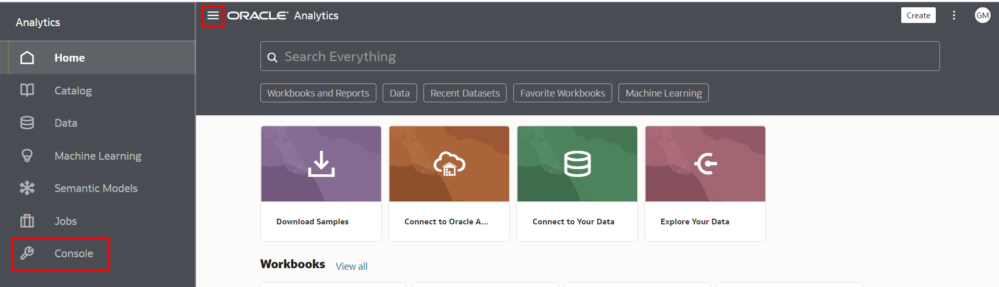
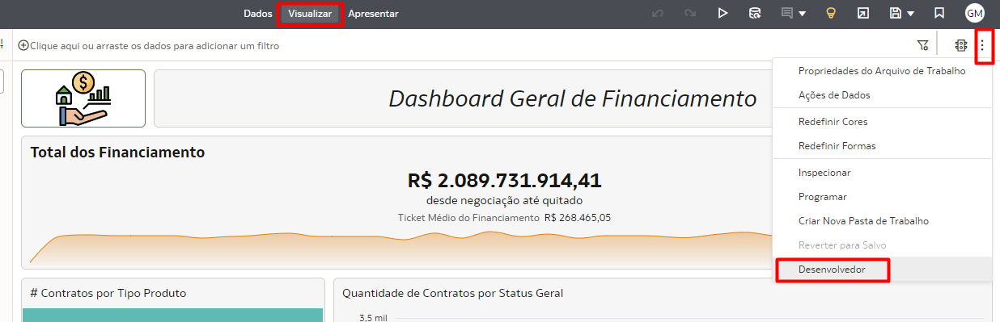

# Atividades Administrativas

## Introdução

Neste Lab você vai aprender a gerenciar a solução Oracle Analytics Cloud.

[Oracle Video Hub video scaled to Large size](videohub:1_k00wf9ol:large)

*Este Lab só pode ser realizado por usuários que possuam o perfil de Administrador dentro do Oracle Analytics Cloud.*

*Tempo estimado para o Lab:* 30 Minutos

### Objetivos

* 
* 
* Customizar uma url customizada de acesso a solução

## Tarefa 1: Acessar Cache e Sessões Abertas

1.	Na página inicial, clique no hambúrguer na lateral esquerda e, em seguida, clique em **"Console"**.

2.	Buscar o botão **"Cache e Sessões Abertas"** e clicar nele.

3.  Navegue pela página e analise as consultas que estão sendo realizadas.

## Tarefa 2: Ativar Opção Desenvolvedor

Nessa Task iremos ativar a funcionalidade de Desenvolvedor no Oracle Analytics Cloud.

1.	Na página inicial, clique nas iniciais do usuário na lateral direita e, em seguida, clique em **"Perfil"**.

2.	Entrar na aba **"Avançado"** e ativar o botão **"Ativar opções Desenvolvedor"** e clicar em **"Salvar"**.

3.  Acesse uma pasta de trabalho no modo edição, clique no botão dos **"3 pontinhos"** do lado direito superios, selecione **"Desenvolvedor"**.

4.  Analise os tempos envolvendo a renderização das visualizações na aba **"Resumo"**, na aba **"SQL Lógico"** pode ver qual SQL está sendo utilizada para cada visualização.

## Tarefa 3: Customização de url de acesso ao Oracle Analytics Cloud (Opcional)

Nessa Task iremos personalizar a url de acesso ao Oracle Analytics Cloud. Porém, para esse caso, é necessário possuir um certificado X.509 com extensão .pem, .cer ou .crt para que seja possível utilizar o domínio desejado na url.

1.	Na console inicial do Oracle Cloud Infrastructure, dentro da tela do Oracle Analytics Cloud, após URL Personalizado, clicar em **"Criar"**.

2.	Na nova tela, digitar o nome do host desejado para a url, incluir o certificado X.509 com o domínio a ser utilizado, incluir uma chave privada no formato .pem ou .key e clicar em **"Criar"**.

3. A instância será atualizada, portanto, ficará indisponível por alguns minutos, em seguida voltará a ficar disponível quando o símbolo do OAC voltar a ficar na cor verde.

## Tarefa 4: Usage Tracking e DV Governance (Opcional)

1.	Para criação de Usage Tracking, tem o passo a passo na seguinte documentação [Usage Tracking com o Semantic Modeler](https://docs.oracle.com/en/cloud/paas/analytics-cloud/acabi/track-usage.html#GUID-F7298880-BE4A-457B-AE24-5DB889848FCC).

2.	Pode criar dashboards para acompanhar as análises. Entender quando está tempo maior volume de acesso e em quais dashboards, quais as consultas com os piores tempo, quem acessa com maior frequência, entro outras análises.

3.  Agora para o DV Governance, será necessário o Plugin DV Governance da Biblioteca de Extensões e realizar a Tarefa 3 do Laboratório de Atividades Administrativas. [Oracle DV Governence - vídeo](https://www.youtube.com/watch?v=QWi06ivvcDI)

4.  A partir dos dados fornecidos pelo plugin, pode se criar dashboards para realizar as análises de governança dos Dashboards, entender quais conjuntos de dados não estão sendo utilizados, quantas pastas de trabalhos existem e quais dados estão utilizando.

Parabéns, você terminou esse laboratório!
Você pode **seguir para o próximo Lab**.

## Conclusão

Nesta sessão você aprendeu a realizar tarefas de gerenciamento do Oracle Analytics Cloud, desde definir a permissão de usuários, realizar backups, customizar a url de acesso a solução e verificar a performance de utilização da solução.

## Autoria

- **Autores** - Gabriela Miyazima
- **Último Updated Por/Data** - Gabriela Miyazima, Agosto/2024