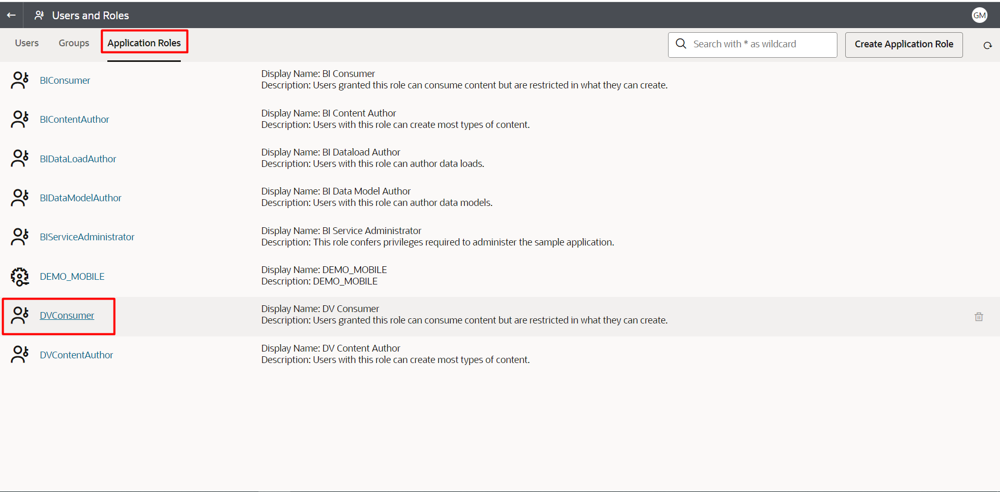
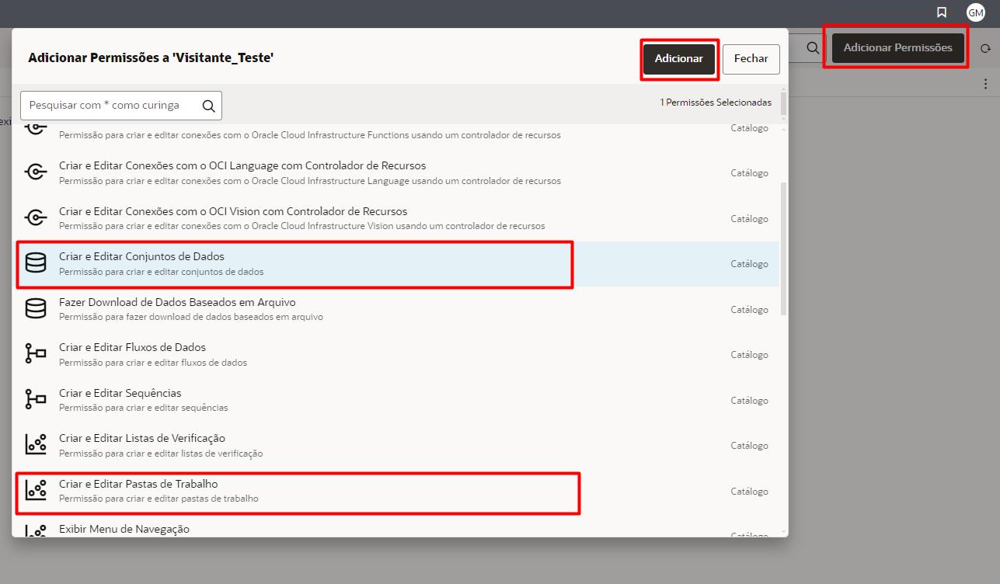

# Atividades Administrativas

## Introdução

Neste Lab você vai aprender a gerenciar a solução Oracle Analytics Cloud.

[Oracle Video Hub video scaled to Large size](videohub:1_k00wf9ol:large)

*Este Lab só pode ser realizado por usuários que possuam o perfil de Administrador dentro do Oracle Analytics Cloud. Não é o caso dos usuários do Fast Track, portanto, está como Lab opcional para usuários que possuam a solução.*

*Tempo estimado para o Lab:* 30 Minutos

### Objetivos

* Criar Backups do ambiente
* Definir o tipo de acesso de usuários
* Explorar Biblioteca de Extensões do OAC

## Tarefa 1: Backup do Ambiente com Snapshots

1.	Na página inicial, clique no hambúrguer na lateral esquerda e, em seguida, clique em **"Console"**.

2.	Buscar o botão **"Snapshots"** e clicar nele.

3.  Clicar em **"Create Snapshot"**, adicionar o nome do arquivo de Backup a sua escolha, nesse tutorial estamos utilizando **"Backup Geral"**, em content escolher a opção **"Everything"** e clicar em **"Create"**.

4.  Aguardar alguns segundos para que o processamento finalize, em seguida, clicar nos 3 pontos e clicar em **"Export"**.

5.  Escolher a opção **"Local File System"**, adicionar uma senha e confirmar essa senha, clicar em **"Export"**.

O arquivo será baixado para a máquina local, mas caso fosse necessário, poderia ser baixado para um ambiente de Data Lake (Object Storage), para isso, no passo 5, basta escolher a opção **"Oracle Cloud Storage"** ao invés de **"Local File System"** e adicionar os detalhes de acesso ao Object Storage.

Para deixar a criação de Snapshot automatizada no ambiente, use as documentações, a seguir:
* [Generate OAC Snapshot using REST API - Blog](https://blogs.oracle.com/analytics/post/generate-oac-snapshot-using-rest-api)
* [REST API for Oracle Analytics Cloud - Documentação](https://docs.oracle.com/en/cloud/paas/analytics-cloud/acapi/op-20210901-snapshots-post.html)
* [Rest API for OAC Snapshot Creation - Vídeo](https://www.youtube.com/watch?v=N31E0Kn9ghA)

## Tarefa 2: Administração de usuários através de Application Roles

Nessa Task iremos realizar o gerenciamento do tipo de acesso dos usuários dentro do Oracle Analytics Cloud.

1.	Na página inicial, clique no hambúrguer na lateral esquerda e, em seguida, clique em **"Console"**.

2.	Buscar o botão **"Users and Roles"** e clicar nele.

3.  Clicar em **"Application Roles"**, escolher em qual role irá adicionar usuários, nesse exemplo, adicionaremos na opção **"DVConsumer"**, então basta clicar na opção.

4.  Para adicionar usuários no grupo desejado, basta clicar na opção **"Users"** e em seguida em **"Add Users"**.

5.  No campo de busca, digitar o nome do usuário desejado seguido por um asterisco (*), clicar em Enter no teclado, selecionar o usuário escolhido e clicar em **"Add"**.

6.  Agora crie uma Application Role. Clicar em **"Application Roles"**, clicar no botão **Create Application Role**, preencha as informações necessárias.

*Nome da Atribuição do Aplicativo:* Visitantes
*Nome para Exibição:* Visitantes
*Descrição:* Acesso a criação de datasets

7.  Entre na Application Role criada "Visitantes" e clique em **Permissões** no item Concessões Diretas.

8.  Adicionar Permissões na Application Role "Visitantes". Clique em **Adicionar Permissões**, pressione o botão controle (CTRL) e selecione os itens "Criar e Editar Conjunto de Dados", "Criar e Editar Pasta de Trabalho" e **Adicionar**.

Para entender em mais detalhes quais são as roles e suas permissões, basta verificar na documentação: https://docs.oracle.com/en/cloud/paas/analytics-cloud/acabi/application-roles.html

## Tarefa 3: Explorar Biblioteca de Extensões do Oracle Analytics Cloud (Opcional)

Nessa Tarefa iremos explorar a Biblioteca de Extensões do Oracle Analytics Cloud, ver quais variedades extra de tipo de visualização estão disponíveis. 

1.	Acesse o site da [Biblioteca de Extensões do OAC](https://www.oracle.com/br/business-analytics/data-visualization/extensions/). Navege pela página analisando quais extensões enriqueceriam os seus dashboards.

2.	**(OPICIONAL)** Caso queira adicionar alguma extensão, acesse a console do OAC, clique em **Extensões**.

3. **(OPICIONAL)** Clique em Fazer Upload de Extensão e selecione o arquivo da extensão.

4. **(OPICIONAL)** Acesse as extensões disponíveis na edição da Pasta de Trabalho.

Parabéns, você terminou esse laboratório!
Você pode **seguir para o próximo Lab**.

## Conclusão

Nesta sessão você aprendeu a realizar tarefas de gerenciamento do Oracle Analytics Cloud, desde definir a permissão de usuários, realizar backups, customizar a extensões.

## Autoria

- **Autores** - Breno Comin, Gabriela Miyazima
- **Último Updated Por/Data** - Gabriela Miyazima, Agosto/2024